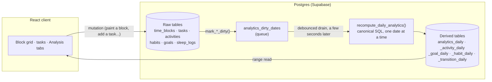

<div align="center">

# ⏱️ TimeBloker

### See where your day actually goes — and trust the numbers that tell you.

A 10-minute-block day tracker with a backend analytics pipeline you can read end to end, and an
analysis area that leads with plain-language answers and explains **every single number** on
hover: what it is, how it's calculated, and what to make of it.

[](LICENSE)
[](https://react.dev)
[](https://www.typescriptlang.org)
[](https://vitejs.dev)
[](https://supabase.com)
[](https://tailwindcss.com)
[](CONTRIBUTING.md)

[Quick start](#-quick-start) ·
[Self-host](#-self-hosting) ·
[Architecture](#-architecture) ·
[FAQ](#-faq) ·
[Contributing](CONTRIBUTING.md)

</div>

---

## 📋 Table of contents

<details open>
<summary>Click to collapse</summary>

- [Why TimeBloker](#-why-timebloker)
- [Feature tour](#-feature-tour)
  - [Track](#track--paint-your-day-in-10-minute-blocks)
  - [Tasks &amp; focus](#tasks--focus--estimate-it-do-it-see-what-it-really-took)
  - [Analysis](#analysis--plain-answers-first-the-maths-one-hover-away)
  - [Sleep](#sleep--tracking-that-explains-itself)
  - [Habits &amp; goals](#habits--goals--streaks-that-mean-something)
  - [Your data](#your-data--yours-to-keep-easy-to-leave-with)
- [Architecture](#-architecture)
  - [Data flow](#data-flow)
  - [Raw vs. derived tables](#raw-vs-derived-tables)
  - [Why a dirty queue, not recompute-on-read](#why-a-dirty-queue-not-recompute-on-read)
- [Tech stack](#-tech-stack)
- [Quick start](#-quick-start)
- [Self-hosting](#-self-hosting)
- [Project structure](#-project-structure)
- [Testing](#-testing)
- [FAQ](#-faq)
- [Roadmap](#-roadmap)
- [Contributing](#-contributing)
- [License](#-license)

</details>

---

## 💡 Why TimeBloker

> [!NOTE]
> Most time trackers either give you a bare log of blocks, or a "productivity score" with no way
> to see how it was computed. TimeBloker tries to do neither.

Three rules the whole analysis layer follows:

| Rule | What it means in practice |
|---|---|
| **Not recorded is not bad** | Empty blocks measure your *logging*, not your discipline. Coverage ("how much did I log") and focus ("how deep was it") are always separate numbers — a quiet day is never silently read as a lazy one. |
| **No mystery scores** | When a score exists, every part and weight that built it is on screen, one hover away ([`lib/explain.ts`](src/lib/explain.ts)). When the data is too thin to say something, the UI says *that* instead of guessing. |
| **Association is not cause** | Sleep-vs-focus and habit comparisons carry sample sizes and confidence intervals, and a change is only called "up" or "down" when it's bigger than your normal day-to-day swing — otherwise it says "about the same." |

If you've ever looked at a productivity app's headline number and thought *"...says who?"* —
this is the app built for the opposite reaction.

<p align="right">(<a href="#-table-of-contents">back to top</a>)</p>

## ✨ Feature tour

### Track — paint your day in 10-minute blocks

A 6×24 grid turns a day into something you can see and edit directly.

<details>
<summary><strong>Details</strong></summary>

- Drag, tap, or drive it entirely from the keyboard — arrows to move, <kbd>Shift</kbd> to extend a
  selection, <kbd>Enter</kbd> repeats your last activity, <kbd>?</kbd> opens the full shortcut list
- Link a block to a task so the task's tracked time accumulates automatically — no manual logging
- Copy yesterday, the previous weekday, last Monday, or any date — only *empty* blocks are filled,
  so copying never clobbers something you already painted
- Untracked time is just untracked. It is never retroactively counted as waste or idle time

</details>

### Tasks & focus — estimate it, do it, see what it really took

<details>
<summary><strong>Details</strong></summary>

- Deadlines with optional times, recurring tasks that roll forward correctly across month/year
  boundaries, and an Eisenhower urgency/importance matrix
- A Pomodoro or stopwatch timer that saves every session with its real start, end and length, and
  tags the time-grid blocks it covers — no separate "focus log" to keep in sync
- Search and filter by today, overdue, upcoming, recurring, or unscheduled
- Inline editing of everything: estimate, linked activity, importance, urgency

</details>

### Analysis — plain answers first, the maths one hover away

Seven tabs, each opening with a short "In short" summary instead of a wall of tiles:

| Tab | Answers | A few things it computes |
|---|---|---|
| **Day** | What did today actually look like? | 24h breakdown, task-linked time vs. other, a generated daily review |
| **Trends** | How are things changing? | Tracked/deep-focus over time, category **or individual activity** distribution, attention vs. value, estimation accuracy, deadline reliability |
| **Focus** | When — and on what — do I focus best? | A peak-focus model with its own stability estimate; a focus-depth curve **coloured by the activity behind every dip** |
| **Waste** | Where does time leak, and why? | Waste triggers (what usually precedes it), typical start time, time-to-recovery after a waste stretch |
| **Patterns** | What usually follows what? | Activity transition flow, your most common "next steps," hours you habitually forget to log |
| **Execution** | Do my tasks and goals turn into action? | An intention → scheduled → started → done funnel, goal pace vs. the pace needed to hit a deadline |
| **Review** | How did this week/month go vs. the one before? | Side-by-side comparison with honest "no clear change" wording when the data doesn't support a verdict |

> [!TIP]
> Hover (or tap, on touch) **any** number in Analysis. A panel opens with the exact formula and a
> read on what it means — nothing is a black box.

### Sleep — tracking that explains itself

<details>
<summary><strong>Details</strong></summary>

- Sleep is just blocks in your day — nothing extra to wear, pair, or start
- A 0–100 score built from duration, continuity, regularity and your own subjective rating, with
  all four parts and their weights shown
- Sleep debt, bedtime regularity, weekend shift, and a rough chronotype estimate
- A "tonight" planner that works backward from your target wake-up time
- Correlations between sleep and next-day focus/waste/productivity, each with its sample size and
  a permutation test so a coincidence doesn't get reported as a finding

</details>

### Habits & goals — streaks that mean something

<details>
<summary><strong>Details</strong></summary>

- Habits can be daily, on specific weekdays, weekly, or "N times a week" — a day still in progress
  never breaks a streak
- A history calendar you can edit for any past date
- Goal progress is read directly from your tracked, linked activities — not a counter you have to
  remember to update
- Current weekly pace shown next to the pace required to hit the deadline

</details>

### Your data — yours to keep, easy to leave with

<details>
<summary><strong>Details</strong></summary>

- CSV, Markdown, a task-time CSV, and a full versioned JSON backup
- An **AI analysis brief**: your real numbers, formatted as a ready-to-paste prompt for whichever
  AI you trust — nothing is ever sent to a third party automatically
- Import previews every change before it's applied and lets you merge or overwrite — it never
  silently deletes a row
- Installable as a PWA; a Windows desktop build with tray icon, notifications and always-on-top
  ([`windows-app/`](windows-app))

</details>

<p align="right">(<a href="#-table-of-contents">back to top</a>)</p>

## 🏗 Architecture

### Data flow



### Raw vs. derived tables

| | Tables | Rule |
|---|---|---|
| **Raw — source of truth** | `activities`, `time_blocks`, `tasks`, `task_focus_sessions`, `habits`, `habit_logs`, `goals`, `sleep_logs`, `reviews`, `user_settings` | Never dropped, never destructively altered. Additive migrations only. |
| **Derived — rebuildable cache** | `analytics_daily`, `analytics_activity_daily`, `analytics_goal_daily`, `analytics_habit_daily`, `analytics_transition_daily` | Safe to delete and rebuild from raw data at any time (`rebuild_analytics_range()`). Every row carries an `analytics_version` so a formula change is traceable. |

### Why a dirty queue, not recompute-on-read

Computing a day's analytics on every page load would mean every screen re-scanning raw blocks —
slow, and an open invitation for two screens to quietly compute the same metric two different
ways. Instead:

1. A mutation (painting a block, completing a task, editing a habit) marks the **affected date**
   dirty — not "recompute everything," just the days that actually changed.
2. A debounced client-side drain calls `process_dirty_analytics()` a few seconds later, so rapid
   edits (dragging across many blocks) coalesce into one recompute instead of one per block.
3. `recompute_daily_analytics()` is the **single canonical definition** of every daily metric —
   tracked/judged/ignored minutes, productivity points, waste, attention, switch counts, run
   lengths, goal and habit progress — written once, in SQL, read everywhere.
4. The frontend's analytics-range cache is invalidated the moment the drain succeeds, so you see
   your own edit reflected within seconds without polling.

Row-level security scopes every table to `auth.uid()`, and the handful of `SECURITY DEFINER`
functions that exist for a scheduled repair job are revoked from every client role — they're
reachable only from a trusted server context, never from the browser.

<p align="right">(<a href="#-table-of-contents">back to top</a>)</p>

## 🧰 Tech stack

| Layer | Choice |
|---|---|
| UI | React 19, TypeScript, Tailwind CSS, Radix primitives, Recharts |
| Build | Vite |
| Backend | Supabase — Postgres, Auth, Realtime, Row-Level Security |
| Analytics | Plain SQL functions (`plpgsql`/`sql`), no ORM between the app and the database |
| Testing | Vitest |
| Desktop | Electron (`windows-app/`) |
| Offline | `vite-plugin-pwa` |

<p align="right">(<a href="#-table-of-contents">back to top</a>)</p>

## 🚀 Quick start

```bash
git clone https://github.com/SedroulReivax/timebloker-app.git
cd timebloker-app
npm install
cp .env.example .env   # fill in your Supabase project's URL + anon key — see Self-hosting below
npm run dev
```

Open `http://localhost:5173`. The landing page runs every analysis engine live on generated
sample data, so you can see the real focus model, sleep scoring and attention calculations before
you ever sign in.

<p align="right">(<a href="#-table-of-contents">back to top</a>)</p>

## 🗄 Self-hosting

TimeBloker has no server component beyond Supabase — the entire backend ships as SQL migrations.

1. **Create a project** at [supabase.com](https://supabase.com) (the free tier is enough to try it).
2. **Apply every file in [`supabase/migrations/`](supabase/migrations) in filename order** — each
   is timestamp-prefixed, so sorted-by-name order *is* the correct apply order. Use the SQL editor,
   the Supabase CLI, or an MCP-connected agent.
3. **Enable the password-reset email code.** In the dashboard: **Auth → Email Templates → Reset
   Password**, add `{{ .Token }}` to the template body. Password reset in this app is a 6-digit
   code typed back into the app, not a magic link — this step is what makes the email actually
   contain the code.
4. **Fill in your environment file:**

   | Variable | Where to find it |
   |---|---|
   | `VITE_SUPABASE_URL` | Project Settings → API → Project URL |
   | `VITE_SUPABASE_ANON_KEY` | Project Settings → API → `anon` `public` key |

   Both are safe to expose in a client bundle by design — every permission they grant is enforced
   by row-level security on the database side, not by keeping the key secret.
5. **Build and deploy** anywhere that serves a static site (`npm run build` → `dist/`). Vercel,
   Netlify, Cloudflare Pages and GitHub Pages all work with zero extra configuration.

> [!IMPORTANT]
> Don't hand-apply migrations out of order, and don't skip one — several SQL functions are
> replaced (`create or replace`) by later migrations, and the final behavior depends on applying
> the whole sequence.

<p align="right">(<a href="#-table-of-contents">back to top</a>)</p>

## 📁 Project structure

```text
src/
├── components/        Screens and UI
│   ├── ui/             Shared primitives (Section, StatTile, hover explanations, password UI...)
│   └── *.tsx            Day view, Analysis tabs, Settings, Sleep hub, Landing...
├── lib/                Pure logic — no React, no network calls
│   ├── analysis.ts, focusModel.ts, waste.ts, flow.ts, execution.ts, sleepAnalysis.ts
│   ├── attention.ts     Attention-vs-value engine
│   ├── explain.ts        The hover-explanation registry for every Analysis card
│   └── *.test.ts         Vitest specs next to the module they cover
└── hooks/              Data loading & mutation
    ├── useSupabaseSync.ts         Every raw-data mutation + its dirty-queue marking
    └── useAnalyticsRange.ts       Cached range reads of the derived analytics tables

supabase/
├── migrations/         Every schema change — additive, idempotent, filename-ordered
└── manual/             Read-only verification queries + the optional pg_cron backup job
```

Every metric has **exactly one definition** — in SQL or a small pure TypeScript function — used
everywhere it appears on screen. Nothing recomputes a number a backend table already has.

<p align="right">(<a href="#-table-of-contents">back to top</a>)</p>

## 🧪 Testing

```bash
npm run typecheck   # tsc -b --noEmit
npm test            # vitest run
npm run lint         # oxlint
npm run build        # typecheck + production build
```

The trickier models (peak-focus depth scoring, sleep scoring, Wilson/bootstrap confidence
intervals) have unit tests built from constructed scenarios with a known right answer, not just
smoke tests.

<p align="right">(<a href="#-table-of-contents">back to top</a>)</p>

## ❓ FAQ

<details>
<summary><strong>Why Supabase instead of a custom backend?</strong></summary>

Row-level security means "every user sees only their own rows" is enforced by Postgres itself,
not by remembering to add a `WHERE user_id = ...` in every query. It also means the entire backend
is describable as SQL migrations — there's no separate API server to deploy or keep in sync.

</details>

<details>
<summary><strong>Is my data private if I self-host?</strong></summary>

Yes. Every table has row-level security scoped to `auth.uid()`. The one thing to configure
yourself is the password-reset email template (see [Self-hosting](#-self-hosting)) — everything
else is enforced at the database layer regardless of what the client sends.

</details>

<details>
<summary><strong>Does the AI analysis brief send my data anywhere?</strong></summary>

No. It builds a prompt from your own canonical analytics and shows it to you to copy — you choose
which AI (if any) to paste it into. There is no server-side AI call and no API key to configure.

</details>

<details>
<summary><strong>Can I use a different database?</strong></summary>

Not without significant rework — the analytics layer is written as Postgres functions
(`plpgsql`/`sql`), and row-level security is a Postgres/Supabase feature specifically.

</details>

<details>
<summary><strong>Why 10-minute blocks and not free-form time entries?</strong></summary>

A fixed grid removes an entire class of input friction (no start/end picker, no overlap
resolution) and makes every day directly comparable — 144 blocks, every day, forever.

</details>

<p align="right">(<a href="#-table-of-contents">back to top</a>)</p>

## 🗺 Roadmap

Deliberately **not** in scope for the current release, documented here so it's not mistaken for
an oversight:

- Advanced sequence analytics (goal-drift detection, capacity-vs-demand, change-point detection)
- A live AI provider integration — the manual copy/paste brief is the intended design, not a stopgap
- Scheduling the `pg_cron` backup-repair job by default (it's documented and ready in
  [`supabase/manual/`](supabase/manual), but the client-side drain is the primary mechanism)

Issues and PRs proposing any of the above are welcome — "deliberately deferred" isn't "closed."

<p align="right">(<a href="#-table-of-contents">back to top</a>)</p>

## 🤝 Contributing

Contributions are welcome — see [CONTRIBUTING.md](CONTRIBUTING.md) for setup, the database-migration
rules, and code style. Good first places to look: an unexplained card in Analysis (add it to
[`lib/explain.ts`](src/lib/explain.ts)), or anything in the [Roadmap](#-roadmap).

## 📄 License

MIT — see [LICENSE](LICENSE). Use it, fork it, ship it; keep the notice.

---

<div align="center">

If this is useful to you, a ⭐ helps other people find it.

[](https://star-history.com/#SedroulReivax/timebloker-app&Date)

</div>
